# Ultimate Retro Shader Collection

[](https://godotengine.org/) [](https://zorochase.itch.io/ultimate-retro-shader-collection-for-godot)

Shaders bringing 5th-gen console aesthetics to Godot 4.

---

<p align="center">

</p>

## Features

- Vertex snapping and affine texture mapping (as seen on *PlayStation* and *Saturn*)
- 3-point texture filtering (as seen on *Nintendo 64*)
- Distance-based, per-vertex texture LOD and fog
- Metallic and shiny shaders
- 3D sprite shaders (shaded/unshaded, single/double-sided)
- Scrolling sky shader (think *Mario 64*)
- Screen-reading dithering and fade shaders
- Create custom spatial shaders using macros
- Compatible with all [rendering backends](https://docs.godotengine.org/en/stable/contributing/development/core_and_modules/internal_rendering_architecture.html#rendering-methods)

## Credits

URSC is built upon various shaders from the Godot community. It would not have been possible without the work done by:
- [MenacingMecha](https://menacingmecha.itch.io/)
	- This collection derives primarily from his [PSX](https://github.com/MenacingMecha/godot-psx-style-demo) and [N64](https://github.com/MenacingMecha/godot-n64-shader-demo) shaders.
- [Zacksly](https://zacksly.itch.io/)
	- The Shiny shaders are adapted from their [PSX Pickup Shader](https://zacksly.itch.io/psx-pickup-shader) for Godot 3.
- [tentabrobpy](https://godotshaders.com/author/tentabrobpy/)
	- The Flat Sky shader is adapted from their [N64 Style Skybox](https://godotshaders.com/shader/n64-style-skybox/) shader on Godot Shaders.

## Getting Started

Check out these articles from the Godot documentation (if you haven't already) before getting started:
- [Available 3D Formats](https://docs.godotengine.org/en/stable/tutorials/assets_pipeline/importing_3d_scenes/available_formats.html)
- [Introduction to Shaders](https://docs.godotengine.org/en/stable/tutorials/shaders/introduction_to_shaders.html)
- [Shader Materials](https://docs.godotengine.org/en/4.3/tutorials/shaders/shader_materials.html)
- [Shading Reference](https://docs.godotengine.org/en/stable/tutorials/shaders/shader_reference/index.html)

There are a few different places you can download the collection from:
- the [Releases](https://github.com/Zorochase/ultimate-retro-shader-collection/releases) page here on GitHub
- the [itch.io](https://zorochase.itch.io/ultimate-retro-shader-collection-for-godot) page
	- Want to see the shaders in action? Head here for a demo you can play right in your browser!
- the [Godot Asset Library](https://godotengine.org/asset-library/asset/2989)
	- If you download URSC through the editor interface, uncheck "ignore asset root" to place the collection in your addons folder.

> [!IMPORTANT]
> Be sure to check the release notes (found under each release on the Releases page linked above) for your download to see which Godot version(s) it was tested with. Generally, the latest release will be tested against the *latest stable version* of Godot.

Of course, there's no need to "enable" URSC through the project settings menu, as it isn't a plugin. However, some additional setup is needed once URSC has been downloaded before you can use the shaders.

URSC depends on a number of [global uniforms](https://docs.godotengine.org/en/stable/tutorials/shaders/shader_reference/shading_language.html#global-uniforms) which need to be added to your project settings. An [editor script](https://docs.godotengine.org/en/stable/classes/class_editorscript.html), `setup.gd` is provided with your download and can be executed through the editor to add these uniforms quickly.

After running this script once (or adding the uniforms to project settings manually), you'll be ready to use URSC shaders in your project.

## Upgrading From v1.3- to v1.4+

In version 1.4.0, URSC's spatial shaders were organized into subfolders to make it easier to select them from the file system view. **This means attempting to upgrade by deleting the old version and copying in the new one _will_ break your materials!**

In versions prior to 1.4.0, URSC's spatial shaders were all placed under the `ursc/spatial` directory, like so:

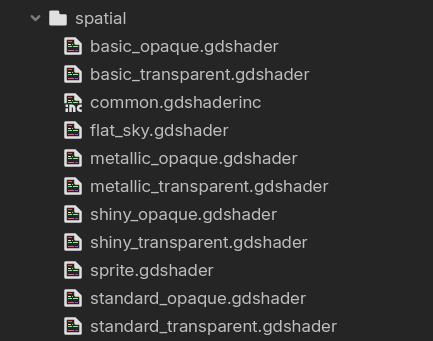

To upgrade safely, you must first reorganize the **existing shaders in your project** to match the layout of newer versions. This ensures the references to them in your materials (and anywhere else) are still valid after the upgrade, preventing you from needing to fix them all manually. Be sure to do any file moving and renaming **inside Godot**.

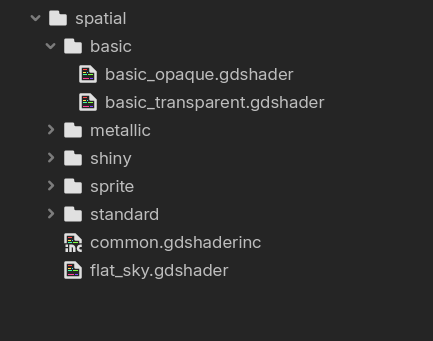

Notice how the Basic shaders have been placed into their own subfolder -- you need to do this for the Basic, Metallic, Shiny, Sprite and Standard shaders. Leave `common.gdshaderinc` and `flat_sky.gdshader` where they are.

After you've reorganized your existing shaders, you can download the latest version and copy over the new files.

One last thing: in 1.4.0, `sprite.gdshader` was renamed to `sprite_shaded.gdshader`. If you correctly followed the previous instructions and then copied over the new files, you'll see something like this in the sprite folder:

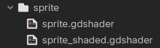

`sprite_shaded.gdshader` is redundant, so just delete it and rename the old `sprite.gdshader` to `sprite_shaded.gdshader`. Then, open the file and change the `#include` path from `"common.gdshaderinc"` to `"../common.gdshaderinc"`.

All URSC versions after 1.4.0 will remain organized this way, so there'll be no need to take these specific upgrade steps again.

## CanvasItem Shaders

### `dithering.gdshader`

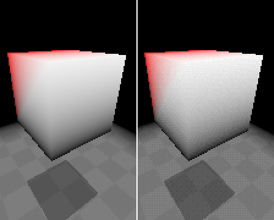

Apply this shader to the material of a CanvasItem node, like a SubViewportContainer. Then, supply a dithering pattern texture and set your preferred color depth. This shader reduces the color depth of the CanvasItem, limiting the number of colors used for rendering, while applying dithering (if a pattern texture is supplied) to minimize the resulting color banding.

In the example above, the shader is applied to a SubViewportContainer with a SubViewport rendering a 3D scene. On the left, the shader is disabled.

> [!NOTE]
> This shader does not *pixelate* anything it's applied to. For that, you likely don't need a shader. If you're using this shader on a SubViewportContainer, you can set its `stretch` property to `true` and either set `stretch_shrink` to a value greater than 1 or set the SubViewport's `size_2d_override_affects_stretch` to true and `size_2d_override` to something like half your window's base size.

> [!TIP]
> You can find a great set of free pattern textures [here](https://github.com/tromero/BayerMatrix), thanks to **tromero**.

### `fade.gdshader`

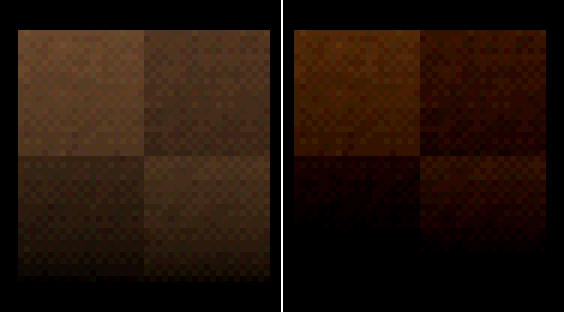

You can use this shader to create a PSX-like "fade-overlay" for scene or menu transitions -- just apply it to the material of a ColorRect node with its layout preset set to "Full Rect." If you're using the dithering shader on a SubViewportContainer, add this ColorRect as a child so it renders above the container's SubViewport.

The `mode` uniform exposed by this shader controls the blending mode to use; a value of **-1** for subtractive (to fade to black), and **1** for additive (to fade to white).

Fading in and out is done by setting the opacity of the node the shader's applied to. With a ColorRect, changing `color.a`, `modulate.a` and `self_modulate.a` all work.

In the example above, both tiles are being dimmed by an overlay with an alpha value of 25. On the left, the shader is disabled (but the overlay is still being rendered). Notice how much deeper and darker the colors are on the right; this effect is due to subtractive blending. With subtractive blending, the lightest colors take the longest to fade out, and vice versa with additive blending.

## Spatial Shaders

Most of the spatial shaders in the collection are organized by category. For example, under `ursc/spatial/standard` you'll see `standard_opaque.gdshader` and `standard_transparent.gdshader`.

> [!IMPORTANT]
> When setting up your model's materials, it's important to select the appropriate shader file for each material. [In general, avoid using transparent shaders unless necessary](https://docs.godotengine.org/en/stable/tutorials/performance/optimizing_3d_performance.html#transparent-objects). If only certain parts of your model require transparency, assign them separate material slots and apply transparent shaders exclusively to those surfaces.

Here's a quick breakdown of the different categories. If you'd like to know what their uniforms do, see the complete list of uniforms in `common.gdshaderinc` further below.

| Category | Description                                                                                                                                                                                                                                                       | Example                                        |
| -------- | ----------------------------------------------------------------------------------------------------------------------------------------------------------------------------------------------------------------------------------------------------------------- | ---------------------------------------------- |
| Basic    | For simple models with no texture, just vertex colors. Prefer this over a Standard shader for a less cluttered inspector.                                                                                                                                         | 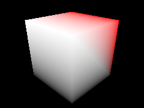    |
| Standard | For the majority of models. Supports mixing an albedo texture with vertex colors.                                                                                                                                                                                 | 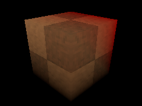 |
| Metallic | Gives models a metallic or reflective look. Be sure your model is *smooth-shaded* for best results. **NOTE**: the texture in the example is not generated by the shader -- you must supply your own texture.                                                      | 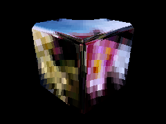 |
| Shiny    | Gives models a shiny or glossy look. Be sure your model is *flat-shaded* for best results. No albedo texture or vertex colors -- you must set the color of the model with the `albedo_color` uniform.                                                             | 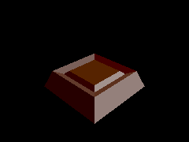    |
| Sprite   | Designed to be applied to a MeshInstance3D (with a QuadMesh or PlaneMesh) or an AnimatedSprite3D. Uses alpha scissor transparency and supports billboarding. See **Tips and Tricks** below for a guide on how to set up an AnimatedSprite3D with a Sprite shader. | 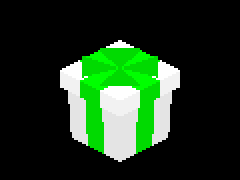   |

### `flat_sky.gdshader`

This is a special shader that can be used to create a sort of "sky background" which scrolls as the camera moves. To use it:
1. Create a new MeshInstance3D in your scene. Consider keeping it aligned with your camera by adding it as a child of the camera. Name it something like "Sky."
2. Add a new BoxMesh to the Sky node. Set its size to something very large in all axes, like 1,000 units. You want it to cover your entire scene and be large enough that distant surfaces are culled before the sky "clips" over them. Enable the BoxMesh's `flip_faces` option.
3. Add a new ShaderMaterial with `flat_sky.gdshader` to the Sky node. Supply a texture to the `albedo_texture` uniform and adjust `uv_offset`, `uv_scale` and `uv_scroll_speed` to your liking.

> [!NOTE]
> If you have a first-person camera, you'll want to limit its pitch to about ±89° or less -- if you have it at 90°, you'll notice the sky "flip" when looking all the way up or down.

> [!TIP]
> If you don't have any sky textures of your own, you can download a fantastic set of seamless sky textures for free from [here](https://screamingbrainstudios.itch.io/seamless-sky-backgrounds), thanks to **Screaming Brain Studios**.

### `common.gdshaderinc`

This is the foundation of all the spatial shaders in the collection (except for `flat_sky.gdshader`). It makes extensive use of [preprocessor macros](https://docs.godotengine.org/en/stable/tutorials/shaders/shader_reference/shader_preprocessor.html) to determine the render mode, uniforms and functionality of whatever shader file includes it.

If you need your model to look a certain way, and there isn't a shader already provided by the collection which achieves that look, you can configure your own shader file by including `common.gdshaderinc` and defining some macros. For instance, suppose you want to completely disable lighting (ambient, directional and fog) for a particular model. Being this isn't a very common case, URSC does not provide a shader file to accomplish this -- however, you can create your own shader file which does.

```glsl
// my_custom_shader.gdshader
shader_type spatial;

// Macro definitions must go first.
// The ones you define depend on your intended look.
// These are for the example above.
#define AMBIENT_LIGHT_DISABLED
#define UNSHADED
#define FOG_DISABLED

// If you save this shader file to disk next to common.gdshaderinc:
#include "common.gdshaderinc"

// OR, if this shader is embedded in a material:
#include "res://path/to/common.gdshaderinc"
```

Of course, you are free to edit `common.gdshaderinc` itself. You can define some macros at the top to change how all URSC shaders work.

#### Macros

These are all the macros which affect the compilation of `common.gdshaderinc`.

| Macro                             | Description                                                                                                                                                                                                                                                                                                                     |
| --------------------------------- | ------------------------------------------------------------------------------------------------------------------------------------------------------------------------------------------------------------------------------------------------------------------------------------------------------------------------------- |
| `ALPHA_BLEND`                     | Enables transparency.                                                                                                                                                                                                                                                                                                           |
| `ALPHA_SCISSOR`                   | Enables alpha scissor transparency. Exposes the `alpha_scissor` uniform. With alpha scissor transparency, semi-transparent areas whose opacity is below the value of the `alpha_scissor` uniform are not drawn. This is primarily used for the Sprite shaders.                                                                  |
| `AMBIENT_LIGHT_DISABLED`          | Disables ambient lighting from a WorldEnvironment node.                                                                                                                                                                                                                                                                         |
| `BILLBOARD`                       | Enables billboarding. Exposes the `billboard_mode` uniform. This is primarily used for the Sprite shaders.                                                                                                                                                                                                                      |
| `BLEND_MODE`                      | Allows you to set the shader's blend mode. See [rendering modes](https://docs.godotengine.org/en/stable/tutorials/shaders/shader_reference/spatial_shader.html#render-modes) for options.                                                                                                                                       |
| `CULL_MODE`                       | Allows you to set the shader's cull mode. See [rendering modes](https://docs.godotengine.org/en/stable/tutorials/shaders/shader_reference/spatial_shader.html#render-modes) for options.                                                                                                                                        |
| `FOG_DISABLED`                    | Disables fog.                                                                                                                                                                                                                                                                                                                   |
| `OVERRIDE_VERTEX_SNAP_RESOLUTION` | Causes the shader to ignore the `vertex_snap_intensity` uniform, allowing you to set the resolution of the vertex snapping grid directly by setting the `vertex_snap_resolution` global uniform. **NOTE**: this uniform is NOT added to project settings by running `setup.gd` -- you'll have to add it yourself as an `ivec2`. |
| `SHINY`                           | Used to create the Shiny shaders.                                                                                                                                                                                                                                                                                               |
| `TEXTURE_DISABLED`                | Prevents the exposure of the `albedo_texture` uniform and any UV-related uniforms. This is primarily used for the Basic shaders.                                                                                                                                                                                                |
| `TEXTURE_METAL`                   | Used to create the Metallic shaders.                                                                                                                                                                                                                                                                                            |
| `TEXTURE_REPEAT` (v1.1+)          | Enables texture repeat, causing the model's texture to tile across surfaces where UV coordinates extend beyond the standard 0 to 1 range.                                                                                                                                                                                       |
| `UNSHADED`                        | Disables lighting from Light3D nodes. **NOTE**: this does NOT disable ambient lighting or fog. For those, define `AMBIENT_LIGHT_DISABLED` and `FOG_DISABLED`.                                                                                                                                                                   |
| `USE_ENVIRONMENT_FOG` (v1.3+)     | `common.gdshader` has its own per-vertex, distance-based fog implementation, which is more friendly to the retro aesthetic. If you'd rather use the pixel-based fog of a WorldEnvironment node, you can define this at the top of `common.gdshader` to disable its custom fog.                                                  |

#### Uniforms

These are all the uniforms compiled in `common.gdshaderinc` depending on the macros that have been defined in a shader file before its inclusion.

| Uniform                                       | Type             | Description                                                                                                                                                                                                                                                                                                                                                                                                                                                                                                                                         |
| --------------------------------------------- | ---------------- | --------------------------------------------------------------------------------------------------------------------------------------------------------------------------------------------------------------------------------------------------------------------------------------------------------------------------------------------------------------------------------------------------------------------------------------------------------------------------------------------------------------------------------------------------- |
| `affine_texture_mapping`                      | `global bool`    | Controls whether affine texture mapping ("texture warping") is enabled for all textured surfaces.                                                                                                                                                                                                                                                                                                                                                                                                                                                   |
| `cull_distance`                               | `global float`   | Controls the visibility range of all surfaces relative to the current camera. If set to 0, shader-based culling will be disabled, except for surfaces with `cull_distance_override` set.                                                                                                                                                                                                                                                                                                                                                            |
| `fog_color` (v1.3+)                           | `global vec3`    | Controls the color of URSC's fog.                                                                                                                                                                                                                                                                                                                                                                                                                                                                                                                   |
| `fog_start_distance` (v1.3+)                  | `global float`   | Controls where URSC's fog starts. Must be less than `fog_end_distance`. If set to 0, fog will start right at the camera's position.                                                                                                                                                                                                                                                                                                                                                                                                                 |
| `fog_end_distance` (v1.3+)                    | `global float`   | Controls where URSC's fog ends. Must be greater than `fog_start_distance`. If set to 0, fog will not render.                                                                                                                                                                                                                                                                                                                                                                                                                                        |
| `texture_filtering`                           | `global bool`    | Controls whether 3-point texture filtering is applied to all textured models.                                                                                                                                                                                                                                                                                                                                                                                                                                                                       |
| `texture_lod_halve_distance` (v1.2+)          | `global float`   | Controls the distance from the current camera at which the texture level of detail is halved for a given surface. When set to 0, texture LOD remains constant, except for surfaces with `texture_lod_halve_distance_override` set.                                                                                                                                                                                                                                                                                                                  |
| `vertex_snap_intensity`                       | `global int`     | Controls the degree of vertex "snappiness," or jitter, for all models. Ranges from 0 to 2.                                                                                                                                                                                                                                                                                                                                                                                                                                                          |
| `vertex_snap_resolution` (optional)           | `global ivec2`   | Controls the resolution for the vertex snapping grid. This is only used if you define the `OVERRIDE_VERTEX_SNAP_RESOLUTION` macro at the top of `common.gdshaderinc` or a custom shader file.                                                                                                                                                                                                                                                                                                                                                       |
| `albedo_color`                                | `vec3` or `vec4` | Controls the overall color of the model. Shaders with the `ALPHA_BLEND` macro defined will expose this as a `vec4`.                                                                                                                                                                                                                                                                                                                                                                                                                                 |
| `albedo_texture`                              | `sampler2D`      | The texture to be applied to the surface.                                                                                                                                                                                                                                                                                                                                                                                                                                                                                                           |
| `albedo_texture_as_primary_color`             | `bool`           | Controls the mixing behavior between the surface's texture and vertex colors. If enabled, lowering the value of the `mix_factor` uniform will reduce the visibility of the vertex colors; otherwise, it will reduce the visibility of the texture.                                                                                                                                                                                                                                                                                                  |
| `mix_factor`                                  | `float`          | Controls the blending of the surface's texture and vertex colors, depending on the value of `albedo_texture_as_primary_color`.                                                                                                                                                                                                                                                                                                                                                                                                                      |
| `cull_distance_override`                      | `float`          | Allows you to override the global `cull_distance` uniform for a particular surface.                                                                                                                                                                                                                                                                                                                                                                                                                                                                 |
| `texture_lod_halve_distance_override` (v1.2+) | `float`          | Allows you to override the global `texture_lod_halve_distance` uniform for a particular surface.                                                                                                                                                                                                                                                                                                                                                                                                                                                    |
| `uv_offset`                                   | `vec2`           | Controls the offset of the surface's texture.                                                                                                                                                                                                                                                                                                                                                                                                                                                                                                       |
| `uv_scale`                                    | `float`          | Controls the scale of the surface's texture.                                                                                                                                                                                                                                                                                                                                                                                                                                                                                                        |
| `uv_scroll_speed`                             | `float`          | Controls the speed at which the surface's texture scrolls. Useful for quickly animating surfaces, like a waterfall.                                                                                                                                                                                                                                                                                                                                                                                                                                 |
| `alpha_scissor`                               | `float`          | Semi-transparent areas of the surface's texture whose opacity falls below this uniforms value will be discarded.                                                                                                                                                                                                                                                                                                                                                                                                                                    |
| `billboard_mode`                              | `int`            | Controls how the surface rotates to face the current camera. Ranges from 0 to 2: 0 disables billboarding, 1 enables billboarding, and 2 enables billboarding limited to the Y-axis.                                                                                                                                                                                                                                                                                                                                                                 |
| `use_transform_scale`                         | `bool`           | If enabled, and `billboard_mode` is either 1 or 2, the model's transform scale will be taken into account.                                                                                                                                                                                                                                                                                                                                                                                                                                          |
| `color_depth`                                 | `float`          | Controls the color depth of Shiny surfaces.                                                                                                                                                                                                                                                                                                                                                                                                                                                                                                         |
| `glossiness`                                  | `float`          | Controls the glossiness of Shiny surfaces.                                                                                                                                                                                                                                                                                                                                                                                                                                                                                                          |
| `shadow_intensity`                            | `float`          | Controls the shadow intensity of Shiny surfaces.                                                                                                                                                                                                                                                                                                                                                                                                                                                                                                    |
| `convert_vertex_colors` (v1.3+)               | `bool`           | When working with certain model formats, like GLTF, in the Compatibility renderer, vertex colors may appear incorrect due to being exported in linear color space. For these formats, where specifying sRGB for vertex colors isn't an option, setting this to true will correct the colors. You can usually tell your vertex colors need to be converted if they appear significantly darker without any additional lighting than they do in your modeling program. This should be left disabled if working with the Forward+ or Mobile renderers. |

## Tips and Tricks

### Models

Keep your models low-poly, but if you're going for a PSX or Saturn look, consider subdividing textured surfaces to mitigate the warping caused by affine texture mapping.

#### Smooth vs. Flat Shading
The Metallic and Shiny shaders require models to be smooth-shaded and flat-shaded, respectively. Godot, and subsequently URSC, don't expose this property. Instead, you need to set it in your modeling program. If you're using Blender to create your models, you can set this by right-clicking your model in Object Mode and choosing **Shade Smooth** for smooth shading or **Shade Flat** for flat shading. You can also control this property per-face by right-clicking on the face on Edit Mode. Check out [this page from the Blender documentation](https://docs.blender.org/manual/en/latest/scene_layout/object/editing/shading.html#shade-smooth) to learn more.

### Textures

Keep your textures low-resolution. Anywhere between 16x16 to 64x64 would be a good range for texture sizes. If you're going for an N64 look, stay within the 32x32 to 64x64 range so the 3-point texture filtering stands out more.

To ensure your textures aren't automatically filtered by Godot, open project settings, and under **Rendering/Textures**, set all filter options to **Nearest**.

### Lighting

The key to lighting a scene for a retro-3D game is to avoid relying heavily on real-time lighting with Light3D nodes and shadows. The PSX, Saturn and N64 all had limited support, if any, for real-time lighting, so artists used vertex colors to feign light in a scene.

While you can get away with using a DirectionalLight3D node and ambient light from a WorldEnvironment, you should avoid using too many SpotLight3D and OmniLight3D nodes.

Godot versions prior to 4.4 do not have vertex-based lighting. Instead, they only have pixel-based lighting, which detracts from the retro look.

Here's a comparison. On the left, you can see the result of pixel-based lighting, which creates a smooth circle. This may look nicer in the image, but that's the problem -- it's *too* nice. For low-poly, jagged models, a more fitting choice would be lighting that complements their rough edges, which would be the vertex-based lighting on the right.

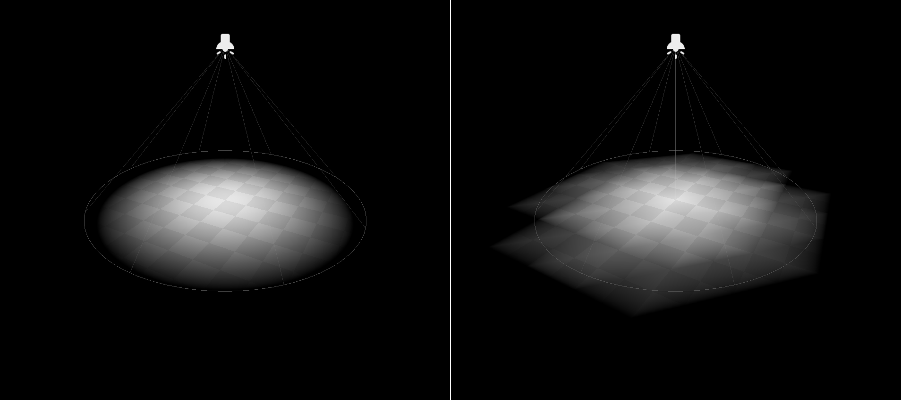

URSC shaders use vertex lighting by default. If you'd rather use pixel lighting, you can remove the `vertex_lighting` render mode option from the top of `common.gdshaderinc`. Likewise, if you want shadows, remove the `shadows_disabled` option.

### Sprites

It's possible to apply the Sprite shaders to AnimatedSprite3D nodes, but it takes a little bit of setup:
1. Set up the AnimatedSprite3D's SpriteFrames resource like normal.
2. Add a ShaderMaterial to the node's Material Override slot (NOT the Material *Overlay* slot), and supply it the Sprite shader of your choice. You'll notice the AnimatedSprite3D's texture disappear -- this can be fixed with some code.
3. Add the following script to the AnimatedSprite3D (with a little translation, this works in C# too):

```gdscript
@tool
extends AnimatedSprite3D


@onready
var shader_material: ShaderMaterial = material_override as ShaderMaterial


func _process(delta: float) -> void:
	shader_material.set_shader_parameter(
		"albedo_texture", sprite_frames.get_frame_texture(animation, frame))

	shader_material.set_shader_parameter("billboard_mode", billboard)

```
