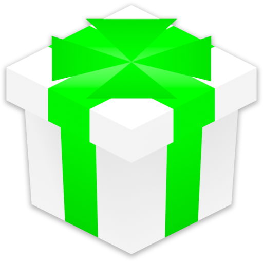

# Ultimate Retro Shader Collection
A compilation of shaders designed to replicate the graphical style of the PlayStation and Nintendo 64 in the Godot engine.

---

## :clipboard: Overview

Ultimate Retro Shader Collection (**URSC**) is a unification and enhancement of various "retro-3D" shaders sourced from the Godot community. These shaders are essential for creating authentic graphics reminiscent of the *PlayStation* (PSX) or *Nintendo 64* (N64).

This repository is home to the collection itself and an interactive demo. You can download the collection as a standalone zip file or get the demo executable by visiting [Releases](https://github.com/Zorochase/ultimate-retro-shader-collection). URSC also has an [itch.io page](https://zorochase.itch.io/ultimate-retro-shader-collection-for-godot) with downloads and a **browser-playable** version of the demo!

### Shader Features:
- Vertex snapping (a.k.a. *vertex jitter*)
- Affine texture mapping (a.k.a. *texture warping*)
- 3-point texture filtering (as seen on N64)
- Distance-based texture LOD (as seen in some PSX games) (1.2.0+)
- Special "metallic/reflective" and "shiny/glossy" effects
- Basic customization through a wide range of uniforms
- Detailed customization with macros
- Bonus shaders:
  - PSX-like additive/subtractive fade
  - Color reduction with dithering
  - Single-image, flat sky (1.2.0+)
- Support for all [rendering methods](https://docs.godotengine.org/en/stable/contributing/development/core_and_modules/internal_rendering_architecture.html#rendering-methods) (`Forward+`, `Mobile`, and `Compatibility`) (1.1.0+)

### Demo Features:
- A variety of samples
- Two camera modes: **orbit** and **free**
- Control shader parameters through the menu
- Background music

### Demo Controls:
- Toggle fullscreen: F11 or alt + enter (option + enter on macOS)
- Toggle menu: escape
- In free mode:
  - Move: WASD; space or E to move up; shift or Q to move down
  - Change movement speed: mouse wheel up/down
- In orbit mode:
  - Toggle orbit: space
  - Reverse orbit direction: shift

### Demo Version Differences:
- The web version:
  - uses the `Compatibility` rendering method.
  - only supports the **orbit** camera mode (all controls for this mode are available).
  - does not support the above controls for toggling fullscreen. To toggle fullscreen, you must use your browser's provided controls. On Itch, a button to enable fullscreen is provided.
  - does not support the above control for toggling the menu.

## :book: Documentation

Check out these articles from the Godot documentation before getting started with URSC. Also, while reading, feel free to experiment with the demo source code by cloning this repository!
- [Available 3D Formats](https://docs.godotengine.org/en/stable/tutorials/assets_pipeline/importing_3d_scenes/available_formats.html)
- [Introduction to Shaders](https://docs.godotengine.org/en/stable/tutorials/shaders/introduction_to_shaders.html)
- [Shader Materials](https://docs.godotengine.org/en/stable/tutorials/shaders/shader_materials.html)
- [Shading Reference](https://docs.godotengine.org/en/stable/tutorials/shaders/shader_reference/index.html)

When you feel comfortable working with shaders in Godot, you can read up on URSC here:
- [Getting Started](docs/getting_started.md)
- [URSC `spatial` Shaders](docs/spatial_shaders.md)
- [URSC `canvas_item` Shaders](docs/canvas_item_shaders.md)
- [Tips and Tricks](docs/tips_and_tricks.md)

## :sunglasses: Credits

Of course, this collection would not've been possible without the amazing work done by:

- [MenacingMecha](https://menacingmecha.itch.io/)
  - This collection derives from his [PSX](https://github.com/MenacingMecha/godot-psx-style-demo) and [N64](https://github.com/MenacingMecha/godot-n64-shader-demo) shaders. If you need inspiration for creating your own retro-3D game, definitely have a look at his work!
- [Zacksly](https://zacksly.itch.io/)
  - The "shiny" effect comes from their [PSX Pickup Shader](https://zacksly.itch.io/psx-pickup-shader) for Godot 3.
- [tentabrobpy](https://godotshaders.com/author/tentabrobpy/)
  - The "flat sky" effect was adapted from [their shader on Godot Shaders](https://godotshaders.com/shader/n64-style-skybox/).
