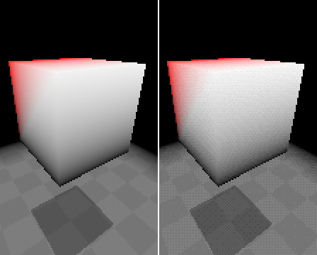
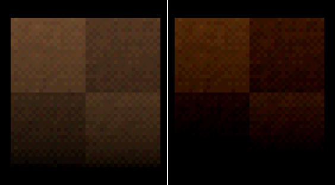

# URSC `canvas_item` Shaders

As of 1.0.0, there are two `canvas_item` shaders included in the collection. These can be found in the `ursc/canvas_items` folder.

## `dithering.gdshader`

Add this shader to the material of a `SubViewportContainer` node.

> [!NOTE]
> If you're looking for *pixelation*, you don't need a shader for that. See the Godot docs for `SubViewportContainer`, [specifically the `stretch` and `stretch_shrink` properties](https://docs.godotengine.org/en/stable/classes/class_subviewportcontainer.html#property-descriptions).

Here's a comparison. On the left, the shader is disabled.

There are two uniforms exposed by this shader:
- `float` `color_depth`: controls the color depth, or number of rendered colors, of the final image. Lower values result in less colors.
- `sampler2D` `dithering_pattern_texture`: the texture that defines the pattern used for dithering, which helps to reduce the visible "banding" that follows color-count reduction. If this uniform is left empty, dithering is disabled, allowing the banding to be visible.

> [!TIP]
> You can find a great set of free pattern textures [here, thanks to **tromero**](https://github.com/tromero/BayerMatrix).

## `fade.gdshader`

To create a PSX-like "fade overlay" for scene/menu transitions, apply this shader to the material of a fullscreen `ColorRect` node.

Only one uniform is exposed by this shader, and that's `int` **`mode`**. `mode` controls the blending mode to use; a value of `-1` for subtractive (to fade to black), and `1` for additive (to fade to white).

Fading is done by setting the opacity of the `ColorRect` node. Changing `color.a`, `modulate.a` and `self_modulate.a` all work.

Here's a comparison. An overlay is drawn over each of these tiles with an alpha value of 25 (0.098). On the left, the shader is disabled. Notice how much deeper and darker the colors are on the right, where the shader is enabled; this effect is due to subtractive blending. With subtractive blending, the lightest colors take the longest to fade out, and vice versa with additive blending.

