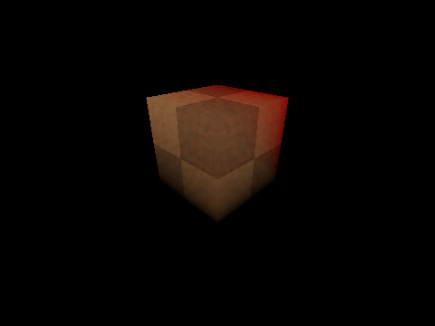
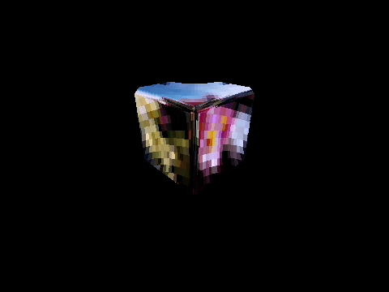
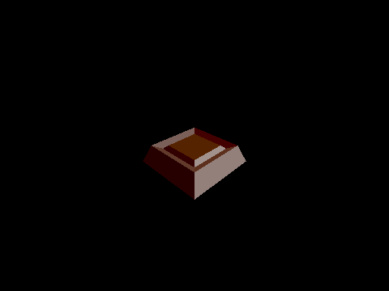
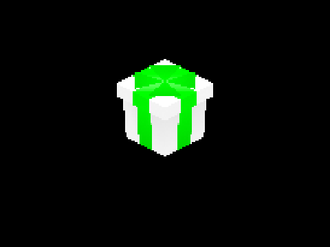
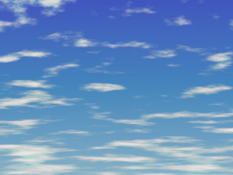

# URSC `spatial` Shaders

In the `ursc/spatial` folder, you'll find several files. Most of the shaders in the collection come in two versions: an *opaque* version and a *transparent* version. This is because [**_you should not use the transparent variant unless you need it._**](https://docs.godotengine.org/en/stable/tutorials/performance/optimizing_3d_performance.html#transparent-objects)

> [!NOTE]
> You only need to use the *transparent* variant when:
> - your model has a (semi-)transparent texture or vertex colors.
> - you want to use the `alpha` component of the `albedo_color` uniform.

## :file_folder: Files

### `common.gdshaderinc`

This file serves as the foundation for all the `spatial` shaders in the collection. It makes extensive use of [macros](https://docs.godotengine.org/en/stable/tutorials/shaders/shader_reference/shader_preprocessor.html#define) to set the `render_mode` and determine which uniforms are exposed when certain shaders are applied to a material.

You can `#include` this file in your own shader file and `#define` particular macros to gain greater control over the appearance of a model beyond what the following files offer. See [:zap: Macros](#zap-macros) for more information.

### `basic_(opaque|transparent).gdshader`

This is for models with *no texture*, just vertex colors. Prefer this over the `standard` shader for quicker shader compilation and a cleaner inspector.


### `standard_(opaque|transparent).gdshader`

This shader is suitable for most models, offering support for blending a texture with vertex colors.



### `metallic_(opaque|transparent).gdshader`

This can be used to give your model a "metallic" or "reflective" look.

> [!NOTE]
> This shader only works properly on *smooth-shaded* models. For more information, see [Tips and Tricks](tips_and_tricks.md/#model-shading).
>
> The texture in the example below is a part of the demo, and is not generated by the shader. You must supply your own texture for this effect to work.



### `shiny_(opaque|transparent).gdshader`

This can be used to give your model a "shiny" or "glossy" look.

> [!NOTE]
> This shader works best on *flat-shaded* models. For more information, see [Tips and Tricks](tips_and_tricks.md/#model-shading).



### `sprite.gdshader`

Apply this shader to the material of a `MeshInstance` with a `QuadMesh` to turn it into a 3D sprite that rotates to face the camera.



### `flat_sky.gdshader` (1.2.0+)

This shader can be used to create an N64-like flat sky out of a single image. To use this shader:
1. Create a new MeshInstance3D node, and name it `Skybox`. This node should be set to follow the current camera in your scene.
2. Add a new BoxMesh to the `Skybox` node. Set the BoxMesh's size to something very large in all axes, like 3,000 units. You want it to cover your entire scene, and be large enough that distance surfaces are culled before the skybox "clips" over them. Additionally, ensure `flip_faces` is enabled.
3. Add a new ShaderMaterial with `flat_sky.gdshader` to the `Skybox` node. Supply a texture to the `albedo_texture` uniform, and adjust `uv_offset`, `uv_scale` and `uv_scroll_speed` to your liking.

> [!NOTE]
> If you make `Skybox` a child of a first-person camera, be sure to limit the vertical viewing angle of the camera to ±89° or less; if you have it at 90°, you'll notice the sky "flip" when looking all the way up or down.
>
> This is currently the only `spatial` shader in the collection that doesn't derive from `common.gdshaderinc`. This is because it doesn't utilize most of the effects offered by `common.gdshaderinc`, as they don't make sense for, or aren't applicable to, this specific effect.
>
> The texture in the example below is not generated by the shader; it comes from a free pack of sky textures, which you can find [here, thanks to **Screaming Brain Studios**](https://screamingbrainstudios.itch.io/seamless-sky-backgrounds)! You must supply your own texture for this effect to work.



## :level_slider: Uniforms

URSC `spatial` shaders offer a wide range of uniforms, which, in most cases, will be enough to help you achieve the desired look for your models.

As previously explained, `common.gdshaderinc` utilizes macros to determine which uniforms a given shader exposes. Reading onward, note that a list of required or incompatible macros indicates whether the macros must or must not be defined in a shader file for the uniform to be exposed by that shader. A complete list of macros recognized by `common.gdshaderinc` can be found [here](#zap-macros).

> [!NOTE]
> :earth_americas: represents *global* uniforms (defined in Project Settings).
>
> :round_pushpin: represents per-material (*local*) uniforms.

### :earth_americas: `bool` `affine_texture_mapping`

If `true`, the "texture warping" effect will be enabled across all textured models.

Incompatible macros:
- `TEXTURE_DISABLED`
- `TEXTURE_METAL`
- `SHINY`

### :earth_americas: `float` `cull_distance`

Controls the visible range of all models, relative to the current camera. When set to `0`, shader-based culling is disabled, unless [:round_pushpin: `cull_distance_override`](#round_pushpin-float-cull_distance_override) is configured.

### :earth_americas: `bool` `texture_filtering`

If `true`, N64-style 3-point texture filtering will be enabled across all textured models.

Incompatible macros:
- `SHINY`
- `TEXTURE_DISABLED`

### :earth_americas: `float` `texture_lod_halve_distance` (1.2.0+)

Controls the distance from the current camera at which the texture level of detail (LOD) for a given surface on any model is halved. When set to `0`, the texture LOD remains constant regardless of the surface's distance from the camera, unless [:round_pushpin: `texture_lod_halve_distance_override`]() is configured. If [:round_pushpin: `texture_filtering`](#earth_americas-bool-texture_filtering) is set to `true`, both of these uniforms will be disregarded, and the texture LOD effect will be disabled.

Incompatible macros:
- `SHINY`
- `TEXTURE_DISABLED`

### :earth_americas: `int` `vertex_snap_intensity`

Controls the degree of vertex "snappiness," or "jitter," for all models.

Ranges from 0 to 2; a value of `0` results in no snapping, while a value of `2` produces maximum snappiness.

> [!NOTE]
> Internally, `common.gdshaderinc` snaps model vertices to a grid with a specific resolution. Overriding this resolution is possible and gives you greater control than this uniform, but at the cost of simplicity; you'll need to calculate the resolution yourself. See `vertex_snap_resolution` below.

Incompatible macros:
- OVERRIDE_VERTEX_SNAP_RESOLUTION

### :earth_americas: `ivec2` `vertex_snap_resolution` (optional)

Controls the degree of vertex "snappiness," or "jitter," for all models. This uniform is only used when the following is added to `common.gdshaderinc` or a custom `.gdshader` file:
```
#define OVERRIDE_VERTEX_SNAP_RESOLUTION
```

> [!NOTE]
> If the above code is added directly to the top of `common.gdshaderinc`, the `vertex_snap_intensity` uniform will never be used.
>
> If you only want control over the snap resolution for specific models, you can add the above code to a custom `.gdshader` file and supply that file to the materials of these models. This approach ensures that models using normal URSC shaders will continue to utilize `vertex_snap_intensity`.

### :round_pushpin: `vec3/vec4` `albedo_color`

Controls the overall color of the model. Shaders with the `ALPHA_BLEND` macro defined will expose this as a `vec4` with an `alpha` component.

### :round_pushpin: `sampler2D` `albedo_texture`

The texture image to be applied to the model.

Incompatible macros:
- `SHINY`
- `TEXTURE_DISABLED`

### :round_pushpin: `bool` `albedo_texture_as_primary_color`

Controls the mixing behavior between the model's texture and vertex colors. If `true`, decreasing the :round_pushpin: `mix_factor` value reduces the visibility of the vertex colors; otherwise, it reduces the visibility of the texture.

Incompatible macros:
- `ALPHA_SCISSOR`
- `SHINY`
- `TEXTURE_DISABLED`

### :round_pushpin: `float` `mix_factor`

Controls the blending of the model's texture and vertex colors, depending on :round_pushpin: `albedo_texture_as_primary_color` to determine which of the two will be more visible when this value is decreased.

Incompatible macros:
- `ALPHA_SCISSOR`
- `SHINY`
- `TEXTURE_DISABLED`

### :round_pushpin: `float` `cull_distance_override`

Controls the visible range of the model, relative to the current camera. A value of `0` means that the default, defined by the [:earth_americas: `cull_distance`](#earth_americas-float-cull_distance) uniform, will be used instead.

### :round_pushpin: `float` `texture_lod_halve_distance_override` (1.2.0+)

Controls the distance from the current camera at which the texture level of detail (LOD) for a given surface on the model is halved. When set to `0`, the texture LOD remains constant regardless of the surface's distance from the camera, unless [:earth_americas: `texture_lod_halve_distance`](#earth_americas-float-texture_lod_halve_distance) is configured. If [:round_pushpin: `texture_filtering`](#earth_americas-bool-texture_filtering) is set to `true`, both of these uniforms will be disregarded, and the texture LOD effect will be disabled.

Incompatible macros:
- `SHINY`
- `TEXTURE_DISABLED`

### :round_pushpin: `vec2` `uv_offset`, `uv_scale`, `uv_scroll_speed`

These control, respectively:
- the offset of the model's texture
- the scale of the model's texture
- the speed at which the texture "scrolls," or moves, along the surface of the model

Incompatible macros:
- `SHINY`
- `TEXTURE_METAL`

### :round_pushpin: `float` `alpha_scissor`

Semi-transparent areas of the model's texture, whose opacity (alpha value) is below the value of this uniform, will not be drawn.

This is primarily used in creating 3D sprites.

Required macros:
- `ALPHA_SCISSOR`

Incompatible macros:
- `SHINY`
- `TEXTURE_DISABLED`
- `TEXTURE_METAL`

### :round_pushpin: `int` `billboard_mode`

Controls how the model rotates to face the current camera. Ranges from 0 to 2; `0` disables billboarding entirely, `1` enables billboarding, and `2` limits billboarding to the Y-axis.

This is primarily used in creating 3D sprites.

> [!NOTE]
> This uniform has *no effect* over the model's `rotation` property; it simply affects how the model is rendered.

Required macros:
- `BILLBOARD`

### :round_pushpin: `bool` `use_transform_scale`

If `true`, scaling a model in billboard mode using the model's `scale` property will be enabled.

This is primarily used in creating 3D sprites.

Required macros:
- `BILLBOARD`

### :round_pushpin: `float` `color_depth`, `glossiness`, `shadow_intensity`

These control the look of the model when its material uses a shader with the `SHINY` macro defined.

Required macros:
- `SHINY`

## :zap: Macros

When none of the above uniforms suit your needs (for instance, you want to modify the shader `render_mode`), you can configure your own shader based on `common.gdshaderinc` using macros.

Here's an example shader:
```
shader_type spatial;

// Macro definitions must come first.
#define OVERRIDE_VERTEX_SNAP_RESOLUTION
#define UNSHADED

#include "common.gdshaderinc"
```

If you want to keep this shader code embedded in a scene file, or you save it to a `.gdshader` file in a different location than `common.gdshaderinc`, you'll need to type out the full path to `common.gdshaderinc`, like so:
```
#include "res://path/to/ursc/common.gdshaderinc"
```

Once again, keep in mind that most (*but not all*) of the following macros are used to expose certain uniforms, and are not to be defined with values of their own.

### `ALPHA_BLEND`

If defined, full transparency support will be enabled in the shader.

This is *entirely incompatible* with the `ALPHA_SCISSOR` macro.

### `ALPHA_SCISSOR`

If defined, the [:round_pushpin: `alpha_scissor`](#round_pushpin-float-alpha_scissor) uniform will be exposed by the shader.

### `AMBIENT_LIGHT_DISABLED`

If defined in a shader, ambient lighting will be disabled on all models with this shader applied.

### `BILLBOARD`

If defined, the [:round_pushpin: `billboard_mode`](#round_pushpin-int-billboard_mode) and [:round_pushpin: `use_transform_scale`](#round_pushpin-bool-use_transform_scale) uniforms will be exposed by the shader.

### `BLEND_MODE`

If defined, this changes the blending mode of the shader.

Example:
```
// Use additive blending:
#define BLEND_MODE blend_add
```

### `CULL_MODE`
If defined, this changes the cull mode of the shader, affecting which faces are discarded.

Example:
```
// Discard front faces instead of back faces:
#define CULL_MODE cull_front
```

> [!NOTE]
> This macro has *nothing to do with* [:earth_americas: `cull_distance`](#earth_americas-float-cull_distance) and [:round_pushpin: `cull_distance_override`](#round_pushpin-float-cull_distance_override); it simply modifies the shader's `render_mode`.

### `FOG_DISABLED`

If defined in a shader, fog will be disabled on all models with this shader applied.

### `OVERRIDE_VERTEX_SNAP_RESOLUTION`

If defined in a shader (or at the top of `common.gdshaderinc`), the [:earth_americas: `vertex_snap_resolution`](#earth_americas-ivec2-vertex_snap_resolution-optional) uniform will be used to determine the resolution of the internal vertex snapping grid for all models using this shader (or any shader including `common.gdshaderinc`).

### `SHINY`

If defined in a shader, the ["shiny" effect](#shiny_opaquetransparentgdshader) will be applied to all models with this shader. Any incompatible uniforms will not be compiled for this shader.

### `TEXTURE_DISABLED`

If defined, the shader will no longer expose any texture-related uniforms.

### `TEXTURE_METAL`

If defined in a shader, the ["metallic" effect](#metallic_opaquetransparentgdshader) will be applied to all models with this shader. Any incompatible uniforms will not be compiled for this shader.

### `TEXTURE_REPEAT` (1.1.0+)

If defined in a shader, texture repeat will be enabled for the albedo texture on all models with this shader. Depending on the model, this may cause visible seams to appear around the edges when [:earth_americas: `texture_filtering`](#earth_americas-bool-texture_filtering) is `true`.

### `UNSHADED`

If defined, lighting provided by any `Light3D` node (`DirectionalLight3D`, `OmniLight3D`, etc.) will be disabled on all models with this shader.

> [!NOTE]
> *This does not disable ambient light or fog*. For those, define [`AMBIENT_LIGHT_DISABLED`](#ambient_light_disabled) and [`FOG_DISABLED`](#fog_disabled).
