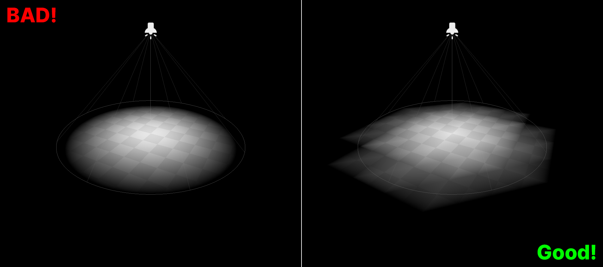
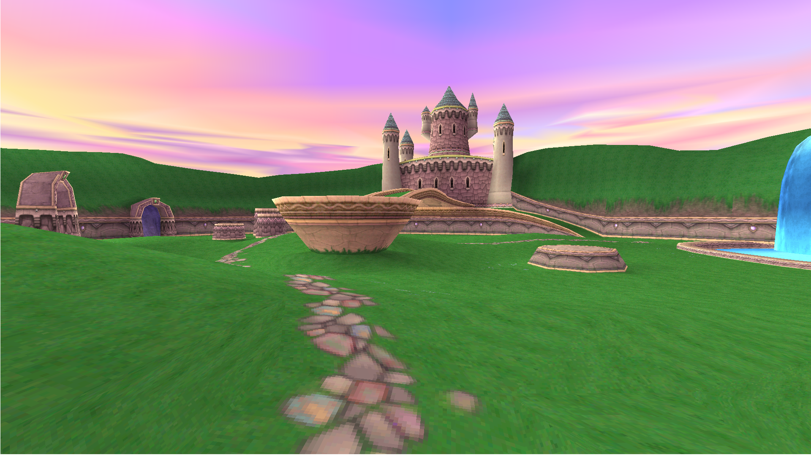
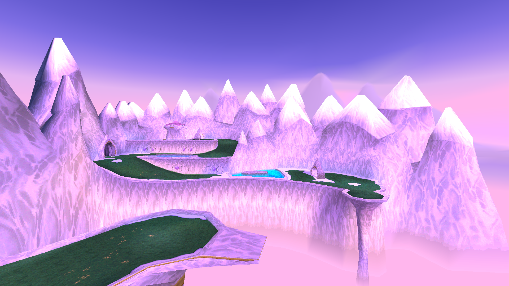
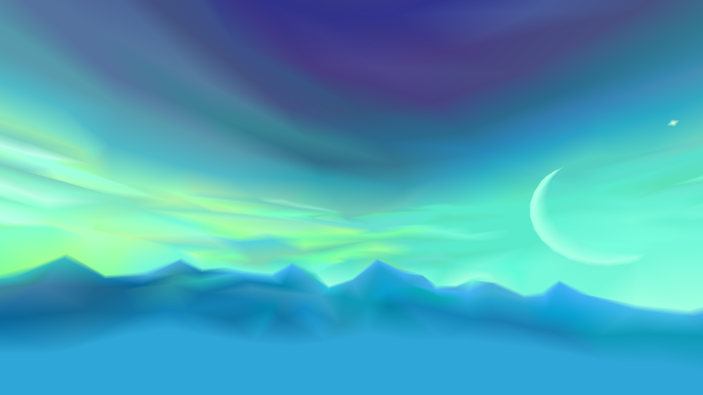
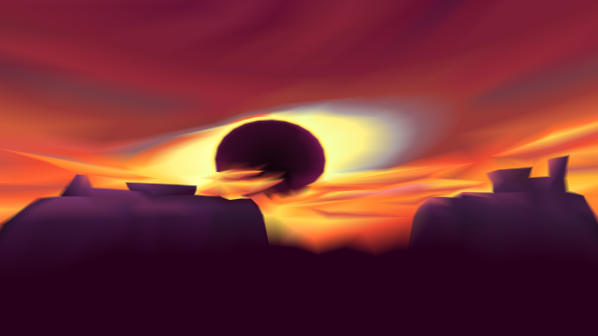

# Tips and Tricks

Here you'll find some useful tips for creating graphics for a retro-3D game.

## 🎲 Models

Keep your models low-poly, but consider subdividing textured surfaces to mitigate the warping caused by affine texture mapping.

### Model Shading

Certain URSC shaders require models to be either flat-shaded or smooth-shaded. With *flat shading*, each polygon of the model has a uniform color across its surface, creating a flat, faceted look. *Smooth shading*, on the other hand, blends the colors between adjacent polygons, creating a more continuous, smooth appearance.

Godot, and subsequently URSC, do not directly expose this property. Instead, you must set it in your modeling program. If you're using Blender to create your models, you can set this by right-clicking your model in Object Mode and choosing **Shade Smooth** for smooth shading or **Shade Flat** for flat shading. You can also control this property per-face by right-clicking on the face on Edit Mode.
Check out [this page from the Blender documentation](https://docs.blender.org/manual/en/latest/scene_layout/object/editing/shading.html#shade-smooth) to learn more.

## 🖼️ Textures

Similar to models, keep your textures low-resolution. Make them especially low-resolution if you're going for the N64 look, as this helps the 3-point texture filtering stand out.

Also, [@sodaraptor_dev](https://twitter.com/sodaraptor_dev) has a [post on Twitter](https://twitter.com/i/bookmarks?post_id=1672759372319956998) which shows how you can use Photoshop to quantize and dither your textures (`dither.gdshader` included in the collection isn't designed for use with model textures). He's made a number of awesome games you should play if you need some more inspiration!

See [⚙️ Project Settings](#⚙️-project-settings) below for some import settings you should change regarding textures.

## 💡 Lighting

The key to lighting a scene for a retro-3D game is to *avoid relying on real-time lighting with `Light3D` nodes and shadows*. Both the PSX and the N64 had limited real-time lighting support, so artists used *vertex colors* to feign lighting in a scene.

While you can get away with using a `DirectionalLight3D` node and ambient light/fog from `WorldEnvironment`, vertex-based lighting is not yet implemented in Godot 4 (though there is a [PR in progress](https://github.com/godotengine/godot/pull/83360)), and pixel-based lighting heavily detracts from the retro aesthetic. Thus, it's best to avoid using `SpotLight3D` and `OmniLight3D` nodes for now (unless you're alright with sacrificing accuracy).

Here's a comparison using Godot 3, which has vertex-based lighting. On the left, you can see the result of pixel-based lighting, which creates a smooth circle. Sure, this looks nicer in the screenshot, but that's the problem: it's *too nice*. For low-poly, jagged models, a more fitting choice would be lighting that complements their rough edges, which would be the vertex-based lighting on the right. URSC shaders use the `vertex_lighting` render mode, so when vertex-based lighting is reimplemented, this will be enabled automatically upon updating.

## 🖌️ Vertex Colors

As mentioned above, vertex colors can be used to simulate lighting. However, their utility extends beyond that. In many games, vertex colors served as a substitute for "texturing" characters, props, etc.

Godot does support vertex colors in models, but has no built-in tools for editing them. Fortunately, [Blender provides all the necessary functionality](https://docs.blender.org/manual/en/latest/sculpt_paint/vertex_paint/index.html), should you choose to use it.

Some things you should know:

- Don't export your model as an `obj` file if you want to use the [`Face Corner`](https://docs.blender.org/manual/en/latest/modeling/meshes/properties/object_data.html#creating-a-new-color-attribute) domain for your Color Attribute. In my testing, `obj` files don't seem to support this domain. Instead, use `glb` or `fbx`.
- Transparent vertex colors *are* possible, but they're tricky to get working and aren't really worth the effort. My advice: just steer clear of them. That being said, Godot and URSC do support them (*however*, the only file format I've found that supports them is `fbx`).

Here are some select shots of *Spyro the Dragon* from the [incredible album](https://imgur.com/a/W4uw7) made by [u/Caitelady](https://www.reddit.com/user/Caitelady/) that exhibit the power and beauty of vertex colors:

## ⚙️ Project Settings

Here are some settings I recommend changing in the **Project Settings** menu. These are not mandatory changes, but they will help you set up your project for the retro look:

- Under **Display/Window**:
  - Viewport Width: `320` or `640`
  - Viewport Height: `180` or `360`
  - **Stretch**:
    - Mode: `disabled`
    - Aspect: `keep`
    - Scale Mode: `integer`

- Under **Rendering**:
  - **Textures**:
    - Default Texture Filter: `Nearest`
    - Default Texture Repeat: this is actually set automatically in `common.gdshader` to `repeat_enable`, so changing this won't affect any models with a shader from the collection.
    - Force PNG: `ON`
    - Anisotropic Filtering Level: `0`
  - **2D**:
    - Snap 2D Transforms to Pixel: `ON`
    - Snap 2D Vertices to Pixel: `ON`
  - **Shading**:
    - **Overrides**:
      - Force Vertex Shading: `ON` (no effect yet 😔)
      - Force Lambert over Burley: `ON`
      - The above two settings are enforced in `common.gdshader`; I just like to set these so models I don't bother applying shaders to (models for testing purposes) still look mostly the same.

- Under **Import Defaults**:
  - **Scene**:
    - **Meshes**:
      - Generate LODs: `OFF`
      - Create Shadow Meshes: `OFF`
      - Light Baking: `Disabled`
    - **Animation**:
      - FPS: set this to the default you use in your modeling program. I use `24`.
  - **Texture2D**:
    - **Mipmaps**:
      - Generate: `OFF`
    - **Detect 3D**:
      - Compress To: `Disabled`
  - **Texture3D**:
    - **Compress**:
      - Mode: `Lossless`

> [!NOTE]
> If you make any changes to **Import Defaults**, you will need to reimport any relevant assets brought into your project before you made these changes.
